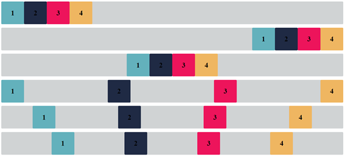

# CSS Flexbox Challenge

## Description

The challenge is to create a layout using CSS Flexbox to achieve a specific design or arrangement of elements on the page, performed activity in the Research and Innovation class at SPTech School

## Objectives

- Use Flexbox to position and organize elements on the page.
- Practice using properties like `display: flex`, `flex-direction`, `justify-content`, and `align-items`.
- Create a responsive layout that adapts to different screen sizes.

## Tasks

1. Create the basic HTML structure of the layout.
2. Apply CSS styles using Flexbox to position elements according to the specified design.
3. Test the layout on different devices and screen sizes to ensure responsiveness.

## Resources

- [Complete Flexbox Guide](https://css-tricks.com/snippets/css/a-guide-to-flexbox/)
- [Flexbox Froggy - A game to practice Flexbox](https://flexboxfroggy.com/)

## Example Layout

